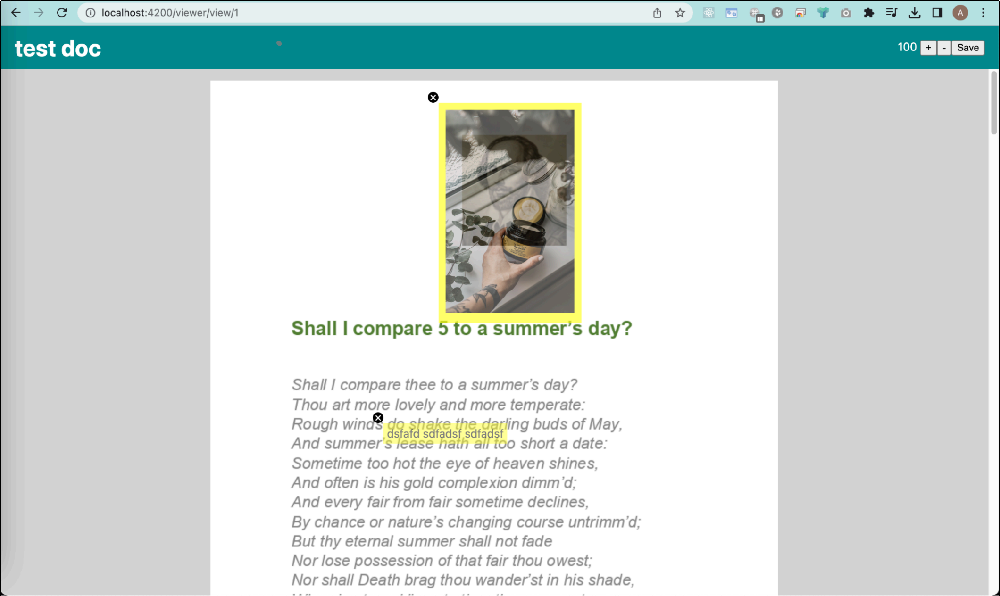

# Тестовое задание

Необходимо создать приложение для просмотра документов и добавления аннотаций.

## Детали:
- Задание должно быть выполнено на фреймворке Angular без использования дополнительных сторонних библиотек, за исключением ui китов вроде Taiga, Angular Material и тп. Стейт менеджер не требуется.
- Пользователь открывает документ по ссылке, в которой есть id документа. Список документов не требуется, будем считать, что пользователь получил прямую ссылку на документ.
- Приложение получает информацию о документе по API, в которой указаны страницы со ссылками на изображения (смотрите приложенный json, его используйте как мокап). Изображения - это страницы документа, пользователь имеет возможность скроллить документ вниз для просмотра всех страниц.
- Документ может быть увеличен или уменьшен (zoom) кнопками “+” и “-”.
- Пользователь может добавлять аннотации в виде текста.
- Добавленные аннотации можно перемещать. Перемещение должно быть реализовано самостоятельно без использования библиотек.
- Можно также удалять аннотации.
- Должна быть кнопка “Сохранить”, при нажатии на которую в консоль выводится информация о документе с добавленными аннотациями.
- Дизайн произвольный, не учитывается при рассмотрении работы, хотя плавность интерфейса будет плюсом.

## Ожидаемый результат:
- Предоставьте исходный код (желательно на github)
- В `README.md` опишите плюсы и минусы реализации, известные проблемы и способы решения

В первую очередь, мы проверяем умение писать чистый и понятный код. Функционал вторичен, но грубые баги интерфейса тоже не допустимы, так как это тоже результат умения программировать.

## Пример реализации:


# 🚀 Установка и запуск

## Установка зависимостей:
```bash
npm install
ng serve
```

# Анализ реализации Angular Material UI Components

## ✅ Преимущества решения

### 1. **Использование Angular Material**
   - **+** Стандартизированные, доступные компоненты
   - **+** Встроенная адаптивность и мобильная поддержка
   - **+** Поддержка тем оформления "из коробки"

### 2. **Архитектурные преимущества**
   - **+** Standalone-компоненты (Angular 16+)
   - **+** Четкое разделение на презентационные компоненты
   - **+** TypeScript для строгой типизации

### 3. **Производительность**
   - **+** OnPush change detection в компонентах
   - **+** Ленивая загрузка модулей
   - **+** Оптимизированные Material-компоненты

## ❌ Недостатки и ограничения

### 1. **Производительность**
   - **-** Большой bundle-размер Angular Material
   *Решение:* Использовать tree-shakable импорты и lazy loading

### 2. **Кастомизация**
 - **-** Сложность глубокой стилизации Material-компонентов
   *Решение:* 
   ```scss
   ::ng-deep .mat-menu-panel {
     max-width: none !important;
   }

### 3. **Адаптивность**
 - **-** Ограниченные breakpoints по умолчанию
   *Решение:* Кастомные медиа-запросы
   ```scss
   @media (max-width: 480px) {
        .mobile-view { display: block; }
    }

## **Известные проблемы и решения**

### 1. FOUC (Flash of Unstyled Content). 
 - **-** Меню кратко отображается без стилей
   *Решение:* Отображать элементы только после получения всех данных
```html
<mat-toolbar [style.visibility]="isLoaded ? 'visible' : 'hidden'">
```

### 2. Z-index конфликты.
 - **-** Меню перекрывается другими элементами
   *Решение:* Указание зчаниея z-index 1000 и более
```scss
.cdk-overlay-container {
  z-index: 1000;
}
```

### 3. Сложности тестирования.
 - **-** Трудности с unit-тестами меню
   *Решение:*  Использовать TestBed с Material модулями
```typescript
beforeEach(async () => {
  await TestBed.configureTestingModule({
    imports: [MatMenuModule]
  }).compileComponents();
});
```

### 3. Улучшение accessibility.
 - **-** Кастомная реализация на div + CSS предоставляет  полный контроль над стилями, но теряется accessibility-функций
   *Решение:*  
```html
<button mat-menu-item aria-label="Close menu">
  <mat-icon>close</mat-icon>
</button>
```

### 4. State management
   *Решение:*  Для сложных состояний использовать NgRx

Вывод: Реализация на Angular Material обеспечивает быструю разработку, но требует дополнительных усилий для глубокой кастомизации и оптимизации.